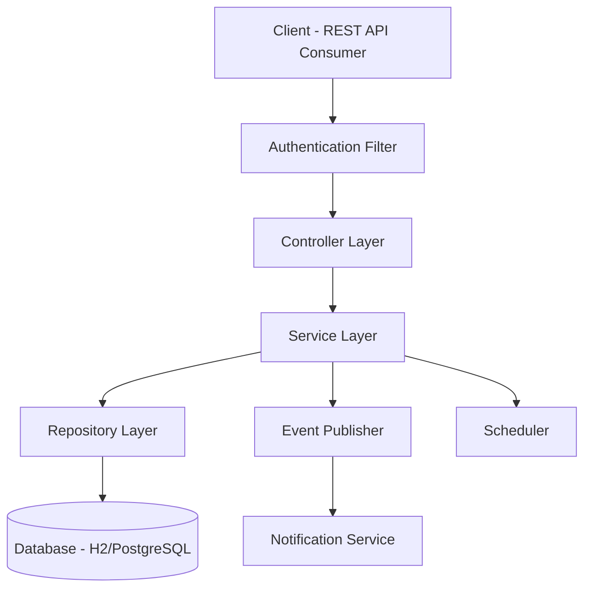
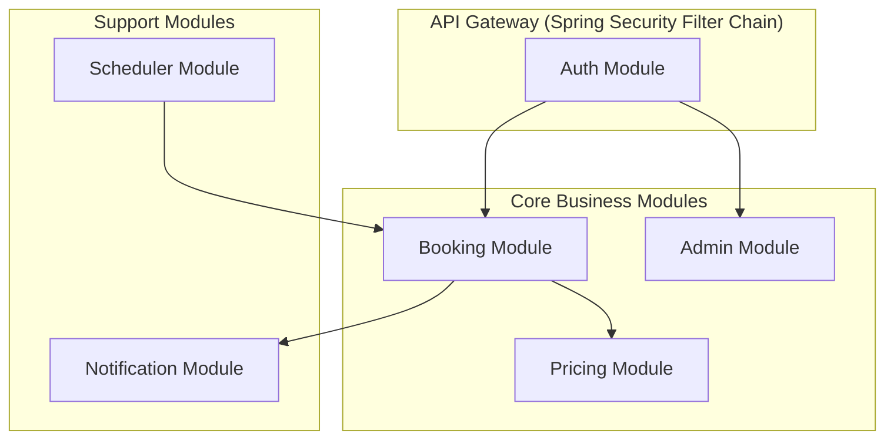
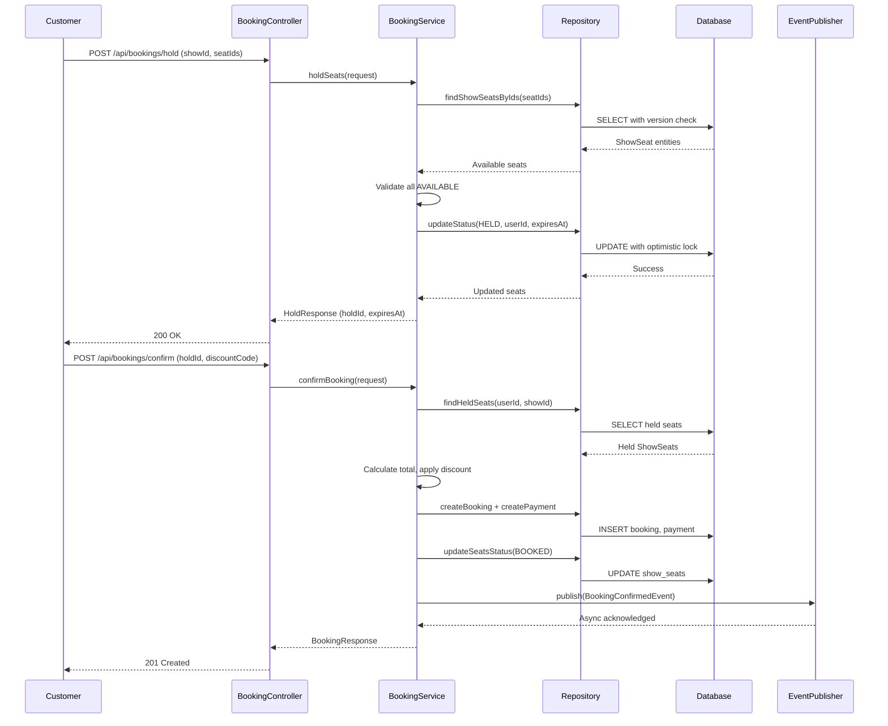
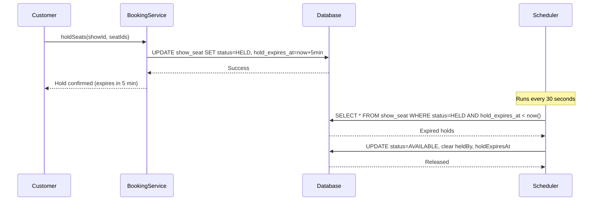
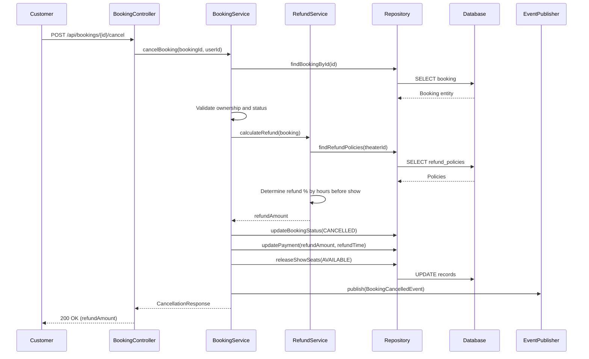
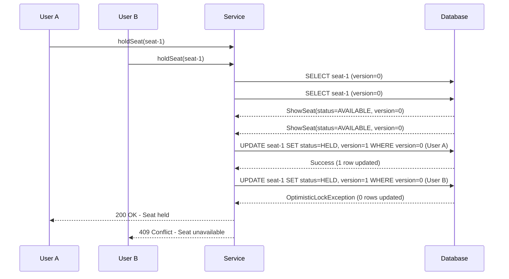
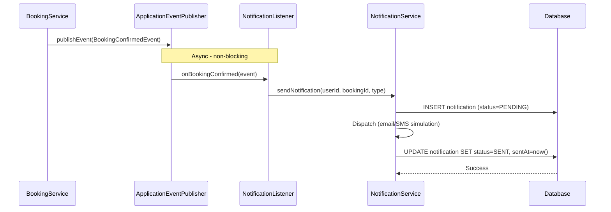

# Movie Ticket Booking System — Design Document

## Table of Contents

- [1. High-Level Design (HLD)](#1-high-level-design-hld)
  - [1.1 System Architecture](#11-system-architecture)
  - [1.2 Component Diagram](#12-component-diagram)
  - [1.3 Tech Stack](#13-tech-stack)
  - [1.4 API Overview](#14-api-overview)
- [2. Low-Level Design (LLD)](#2-low-level-design-lld)
  - [2.1 Booking Flow](#21-booking-flow-sequence-diagram)
  - [2.2 Seat Hold & Expiry Flow](#22-seat-hold--expiry-flow)
  - [2.3 Cancellation & Refund Flow](#23-cancellation--refund-flow)
  - [2.4 Concurrency Control](#24-concurrency-control)
  - [2.5 Notification Flow](#25-notification-flow)
  - [2.6 Authentication & Authorization Flow](#26-authentication--authorization-flow)
- [3. Database Schema](#3-database-schema)
  - [3.1 Entity-Relationship Diagram](#31-entity-relationship-diagram)
  - [3.2 Entity Details](#32-entity-details)
  - [3.3 Indexes](#33-indexes)
- [4. Design Decisions](#4-design-decisions)
- [5. Assumptions](#5-assumptions)

---

## 1. High-Level Design (HLD)

### 1.1 System Architecture

| Layer | Responsibility |
|-------|---------------|
| **Controller Layer** | REST endpoints, request validation, response mapping |
| **Service Layer** | Business logic, transaction management, event publishing |
| **Repository Layer** | Data access via Spring Data JPA, custom queries |
| **Database** | Persistent storage (H2 for dev, PostgreSQL for prod) |
| **Scheduler** | Periodic cleanup of expired seat holds |
| **Event/Notification** | Async notification dispatch via Spring Events |

### 1.2 Component Diagram

### 1.3 Tech Stack

| Technology | Purpose | Justification |
|-----------|---------|---------------|
| Spring Boot 3.x | Application framework | Convention-over-config, embedded server, production-ready |
| Spring Data JPA | Data access | Eliminates boilerplate, query derivation, pagination support |
| Hibernate | ORM | Mature, supports optimistic locking via @Version |
| Spring Security | Auth & RBAC | Industry standard, JWT filter integration |
| H2 Database | Default dev DB | Zero-config, in-memory, fast iteration |
| PostgreSQL | Production DB | ACID-compliant, scalable, robust concurrency |
| Lombok | Boilerplate reduction | Reduces getters/setters/constructors noise |
| JUnit 5 + Mockito | Testing | Modern testing with mocking support |
| Spring Events | Async notifications | Decoupled, non-blocking event-driven architecture |

### 1.4 API Overview

#### Auth Endpoints

| Method | Path | Description | Role |
|--------|------|-------------|------|
| POST | `/api/auth/register` | Register new user | PUBLIC |
| POST | `/api/auth/login` | Login and get JWT | PUBLIC |

#### Admin Endpoints

All admin endpoints are prefixed with `/api/admin` and require `ROLE_ADMIN`. Standard CRUD operations (POST, GET, PUT, DELETE) are available for each resource.

| Resource | Base Path | Notes |
|----------|-----------|-------|
| Cities | `/api/admin/cities` | CRUD |
| Theaters | `/api/admin/cities/{cityId}/theaters` | Nested under city |
| Screens | `/api/admin/theaters/{theaterId}/screens` | Nested under theater |
| Seats | `/api/admin/screens/{screenId}/seats` | Bulk creation supported |
| Shows | `/api/admin/screens/{screenId}/shows` | Auto-generates ShowSeats with pricing |
| Pricing Tiers | `/api/admin/pricing-tiers` | CRUD |
| Discount Codes | `/api/admin/discount-codes` | CRUD |
| Refund Policies | `/api/admin/refund-policies` | CRUD |

#### Customer Endpoints

| Method | Path | Description | Role |
|--------|------|-------------|------|
| GET | `/api/cities` | Browse cities | CUSTOMER |
| GET | `/api/cities/{id}/theaters` | Browse theaters in city | CUSTOMER |
| GET | `/api/theaters/{id}/shows` | Browse shows at theater | CUSTOMER |
| GET | `/api/shows` | Search shows | CUSTOMER |
| GET | `/api/shows/{id}/seats` | View seat availability | CUSTOMER |
| POST | `/api/bookings/hold` | Hold seats (5-min TTL) | CUSTOMER |
| POST | `/api/bookings/confirm` | Confirm booking + payment | CUSTOMER |
| POST | `/api/bookings/{id}/cancel` | Cancel booking | CUSTOMER |
| GET | `/api/bookings` | List my bookings | CUSTOMER |
| GET | `/api/bookings/{id}` | Get booking details | CUSTOMER |

---

## 2. Low-Level Design (LLD)

### 2.1 Booking Flow (Sequence Diagram)

### 2.2 Seat Hold & Expiry Flow

### 2.3 Cancellation & Refund Flow

### 2.4 Concurrency Control

The system uses **optimistic locking** via JPA's `@Version` annotation on the `ShowSeat` entity. When two users attempt to hold the same seat simultaneously, the first commit succeeds while the second receives an `OptimisticLockException`, which is caught and returned as a conflict error.

### 2.5 Notification Flow

### 2.6 Authentication & Authorization Flow

```mermaid
sequenceDiagram
    participant C as Client
    participant AF as JwtAuthFilter
    participant SC as SecurityContext
    participant CT as Controller
    participant AS as AuthService
    participant DB as Database

    Note over C,DB: Login Flow
    C->>CT: POST /api/auth/login (email, password)
    CT->>AS: authenticate(credentials)
    AS->>DB: findUserByEmail
    DB-->>AS: User entity
    AS->>AS: Verify password (BCrypt)
    AS->>AS: Generate JWT (sub=userId, role=ROLE)
    AS-->>CT: JWT token
    CT-->>C: 200 OK (token)

    Note over C,DB: Authenticated Request Flow
    C->>AF: GET /api/bookings (Authorization: Bearer token)
    AF->>AF: Extract and validate JWT
    AF->>AF: Parse claims (userId, role)
    AF->>SC: Set Authentication
    SC->>CT: Dispatch to controller
    CT->>CT: @PreAuthorize check role
    CT-->>C: 200 OK (data)
```

---

## 3. Database Schema

### 3.1 Entity-Relationship Diagram

```mermaid
erDiagram
    USER ||--o{ BOOKING : places
    USER ||--o{ SHOW_SEAT : holds
    USER ||--o{ NOTIFICATION : receives

    CITY ||--o{ THEATER : contains
    THEATER ||--o{ SCREEN : has
    THEATER ||--o{ PRICING_TIER : defines
    THEATER ||--o{ REFUND_POLICY : defines

    SCREEN ||--o{ SEAT : contains
    SCREEN ||--o{ SHOW : hosts

    SHOW ||--o{ SHOW_SEAT : generates
    SEAT ||--o{ SHOW_SEAT : maps

    BOOKING ||--o{ BOOKING_SEAT : includes
    BOOKING ||--|| PAYMENT : has
    BOOKING ||--o| DISCOUNT_CODE : uses
    BOOKING ||--o{ NOTIFICATION : triggers

    SHOW_SEAT ||--o{ BOOKING_SEAT : reserved_in

    USER {
        Long id PK
        String name
        String email
        String password
        String role
        LocalDateTime createdAt
    }

    CITY {
        Long id PK
        String name
    }

    THEATER {
        Long id PK
        String name
        String address
        Long cityId FK
    }

    SCREEN {
        Long id PK
        String name
        Long theaterId FK
        Integer totalSeats
    }

    SEAT {
        Long id PK
        Long screenId FK
        String row
        Integer number
        String seatType
    }

    SHOW {
        Long id PK
        String movieName
        Long screenId FK
        LocalTime startTime
        LocalTime endTime
        LocalDate date
    }

    SHOW_SEAT {
        Long id PK
        Long showId FK
        Long seatId FK
        String status
        BigDecimal price
        Long heldBy FK
        LocalDateTime holdExpiresAt
        Integer version
    }

    BOOKING {
        Long id PK
        Long userId FK
        Long showId FK
        String status
        BigDecimal totalAmount
        BigDecimal discountApplied
        Long discountCodeId FK
        LocalDateTime bookingTime
    }

    BOOKING_SEAT {
        Long bookingId FK
        Long showSeatId FK
    }

    PRICING_TIER {
        Long id PK
        String name
        String seatType
        BigDecimal multiplier
        BigDecimal basePrice
        String applicableDays
        Long theaterId FK
    }

    DISCOUNT_CODE {
        Long id PK
        String code
        String type
        BigDecimal value
        Integer maxUses
        Integer currentUses
        LocalDate validFrom
        LocalDate validTo
        BigDecimal minBookingAmount
    }

    REFUND_POLICY {
        Long id PK
        String name
        Integer hoursBeforeShow
        Integer refundPercentage
        Long theaterId FK
    }

    PAYMENT {
        Long id PK
        Long bookingId FK
        BigDecimal amount
        String status
        LocalDateTime paymentTime
        BigDecimal refundAmount
        LocalDateTime refundTime
    }

    NOTIFICATION {
        Long id PK
        Long userId FK
        Long bookingId FK
        String type
        String channel
        String status
        LocalDateTime sentAt
        LocalDateTime createdAt
    }
```

### 3.2 Entity Details

#### User

| Field | Type | Constraints | Notes |
|-------|------|-------------|-------|
| id | Long | PK, Auto-generated | |
| name | String | NOT NULL | |
| email | String | NOT NULL, UNIQUE | Used for login |
| password | String | NOT NULL | BCrypt hashed |
| role | String (Enum) | NOT NULL | ADMIN or CUSTOMER |
| createdAt | LocalDateTime | NOT NULL | Auto-set on creation |

#### City

| Field | Type | Constraints | Notes |
|-------|------|-------------|-------|
| id | Long | PK, Auto-generated | |
| name | String | NOT NULL, UNIQUE | |

#### Theater

| Field | Type | Constraints | Notes |
|-------|------|-------------|-------|
| id | Long | PK, Auto-generated | |
| name | String | NOT NULL | |
| address | String | NOT NULL | |
| cityId | Long | FK → City.id, NOT NULL | |

#### Screen

| Field | Type | Constraints | Notes |
|-------|------|-------------|-------|
| id | Long | PK, Auto-generated | |
| name | String | NOT NULL | e.g., "Screen 1" |
| theaterId | Long | FK → Theater.id, NOT NULL | |
| totalSeats | Integer | NOT NULL | Denormalized count |

#### Seat

| Field | Type | Constraints | Notes |
|-------|------|-------------|-------|
| id | Long | PK, Auto-generated | |
| screenId | Long | FK → Screen.id, NOT NULL | |
| row | String | NOT NULL | e.g., "A", "B" |
| number | Integer | NOT NULL | Seat number in row |
| seatType | String (Enum) | NOT NULL | REGULAR, PREMIUM, VIP |

#### Show

| Field | Type | Constraints | Notes |
|-------|------|-------------|-------|
| id | Long | PK, Auto-generated | |
| movieName | String | NOT NULL | |
| screenId | Long | FK → Screen.id, NOT NULL | |
| startTime | LocalTime | NOT NULL | |
| endTime | LocalTime | NOT NULL | |
| date | LocalDate | NOT NULL | |

#### ShowSeat

| Field | Type | Constraints | Notes |
|-------|------|-------------|-------|
| id | Long | PK, Auto-generated | |
| showId | Long | FK → Show.id, NOT NULL | |
| seatId | Long | FK → Seat.id, NOT NULL | |
| status | String (Enum) | NOT NULL | AVAILABLE, HELD, BOOKED |
| price | BigDecimal | NOT NULL | Computed from PricingTier |
| heldBy | Long | FK → User.id, NULLABLE | User holding the seat |
| holdExpiresAt | LocalDateTime | NULLABLE | Hold expiry timestamp |
| version | Integer | NOT NULL, default 0 | Optimistic lock field |

#### Booking

| Field | Type | Constraints | Notes |
|-------|------|-------------|-------|
| id | Long | PK, Auto-generated | |
| userId | Long | FK → User.id, NOT NULL | |
| showId | Long | FK → Show.id, NOT NULL | |
| status | String (Enum) | NOT NULL | CONFIRMED, CANCELLED |
| totalAmount | BigDecimal | NOT NULL | Final amount after discount |
| discountApplied | BigDecimal | NULLABLE | Discount amount |
| discountCodeId | Long | FK → DiscountCode.id, NULLABLE | |
| bookingTime | LocalDateTime | NOT NULL | |

#### BookingSeat

| Field | Type | Constraints | Notes |
|-------|------|-------------|-------|
| bookingId | Long | FK → Booking.id, PK | Composite primary key |
| showSeatId | Long | FK → ShowSeat.id, PK | Composite primary key |

#### PricingTier

| Field | Type | Constraints | Notes |
|-------|------|-------------|-------|
| id | Long | PK, Auto-generated | |
| name | String | NOT NULL | e.g., "Weekend Premium" |
| seatType | String (Enum) | NOT NULL | REGULAR, PREMIUM, VIP |
| multiplier | BigDecimal | NOT NULL | Price multiplier |
| basePrice | BigDecimal | NOT NULL | Base price for tier |
| applicableDays | String | NOT NULL | e.g., "MON,TUE" or "ALL" |
| theaterId | Long | FK → Theater.id, NOT NULL | |

#### DiscountCode

| Field | Type | Constraints | Notes |
|-------|------|-------------|-------|
| id | Long | PK, Auto-generated | |
| code | String | NOT NULL, UNIQUE | e.g., "FLAT50" |
| type | String (Enum) | NOT NULL | PERCENTAGE or FLAT |
| value | BigDecimal | NOT NULL | Discount value |
| maxUses | Integer | NOT NULL | Max redemption count |
| currentUses | Integer | NOT NULL, default 0 | Current redemption count |
| validFrom | LocalDate | NOT NULL | |
| validTo | LocalDate | NOT NULL | |
| minBookingAmount | BigDecimal | NULLABLE | Minimum cart value |

#### RefundPolicy

| Field | Type | Constraints | Notes |
|-------|------|-------------|-------|
| id | Long | PK, Auto-generated | |
| name | String | NOT NULL | e.g., "24hr Full Refund" |
| hoursBeforeShow | Integer | NOT NULL | Threshold in hours |
| refundPercentage | Integer | NOT NULL | 0–100 |
| theaterId | Long | FK → Theater.id, NOT NULL | |

#### Payment

| Field | Type | Constraints | Notes |
|-------|------|-------------|-------|
| id | Long | PK, Auto-generated | |
| bookingId | Long | FK → Booking.id, NOT NULL, UNIQUE | |
| amount | BigDecimal | NOT NULL | Amount charged |
| status | String (Enum) | NOT NULL | SUCCESS, REFUNDED, PARTIAL_REFUND |
| paymentTime | LocalDateTime | NOT NULL | |
| refundAmount | BigDecimal | NULLABLE | Amount refunded |
| refundTime | LocalDateTime | NULLABLE | |

#### Notification

| Field | Type | Constraints | Notes |
|-------|------|-------------|-------|
| id | Long | PK, Auto-generated | |
| userId | Long | FK → User.id, NOT NULL | |
| bookingId | Long | FK → Booking.id, NOT NULL | |
| type | String (Enum) | NOT NULL | BOOKING_CONFIRMED, BOOKING_CANCELLED |
| channel | String (Enum) | NOT NULL | EMAIL, SMS |
| status | String (Enum) | NOT NULL | PENDING, SENT, FAILED |
| sentAt | LocalDateTime | NULLABLE | |
| createdAt | LocalDateTime | NOT NULL | |

### 3.3 Indexes

| Table | Index | Columns | Purpose |
|-------|-------|---------|---------|
| user | idx_user_email | email | Fast login lookup |
| theater | idx_theater_city | city_id | Filter theaters by city |
| show | idx_show_screen_date | screen_id, date | Find shows by screen and date |
| show | idx_show_movie | movie_name | Search by movie name |
| show_seat | idx_show_seat_show | show_id | List seats for a show |
| show_seat | idx_show_seat_status_expiry | status, hold_expires_at | Scheduled cleanup of expired holds |
| show_seat | idx_show_seat_held_by | held_by | Find seats held by user |
| booking | idx_booking_user | user_id | List user bookings |
| booking | idx_booking_show | show_id | Find bookings for a show |
| payment | idx_payment_booking | booking_id | Lookup payment by booking |
| notification | idx_notification_user | user_id | User notification history |
| discount_code | idx_discount_code | code | Fast code lookup |
| pricing_tier | idx_pricing_theater_type | theater_id, seat_type | Price computation |
| refund_policy | idx_refund_theater | theater_id | Refund calculation |

---

## 4. Design Decisions

1. **H2 as default DB** — Zero setup for development; PostgreSQL supported via Spring profile for production readiness.
2. **Optimistic locking on ShowSeat** — Avoids pessimistic lock contention; the short hold window means conflicts are rare and retries are cheap.
3. **5-minute hold with 30s cleanup** — Balances user experience (enough time to pay) with seat availability (prevents indefinite blocking).
4. **Price stored on ShowSeat at show-creation** — Decouples pricing from booking-time calculations; ensures price consistency even if tiers change later.
5. **Sliding-scale refund per theater** — Each theater defines multiple refund policies with different hour thresholds; the best matching policy is applied.
6. **Async notifications via Spring Events** — Non-blocking; booking flow isn't delayed by notification delivery. Failures are recorded but don't roll back bookings.
7. **JWT + Spring Security RBAC** — Stateless auth scales horizontally; role-based access enforced via method-level annotations.
8. **Composite PK for BookingSeat** — Natural join table; avoids surrogate key overhead for a pure relationship entity.
9. **Discount code usage tracking** — `currentUses` incremented atomically on confirmation to prevent over-redemption.
10. **Denormalized totalSeats on Screen** — Avoids count queries; updated when seats are bulk-created.

---

## 5. Assumptions

1. Single-region deployment; no distributed locking or cross-DC replication required.
2. Payment is simulated (no real payment gateway integration); success is assumed on confirm.
3. Notifications are simulated (logged); no real email/SMS provider integration.
4. One show maps to one screen at a time; no multi-screen shows.
5. Seat layout is static per screen; dynamic reconfiguration is not supported.
6. Discount codes are global (not theater-specific).
7. A user can hold seats for only one show at a time (enforced in business logic).
8. Movie catalog is simplified to a name field on Show (no separate Movie entity).
9. All times are in server timezone; no multi-timezone support.
10. Admin user is pre-seeded or registered via the same endpoint with role override.

---

> For functional requirements and acceptance criteria, see [REQUIREMENTS.md](./REQUIREMENTS.md).
